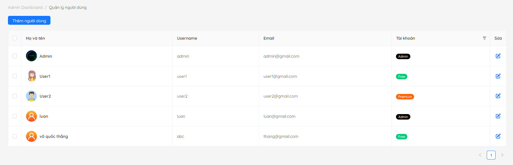
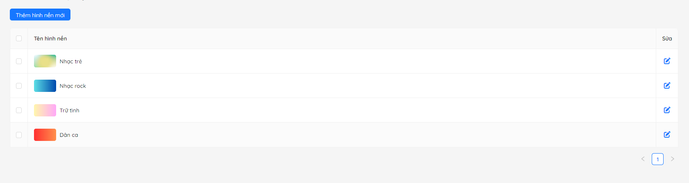
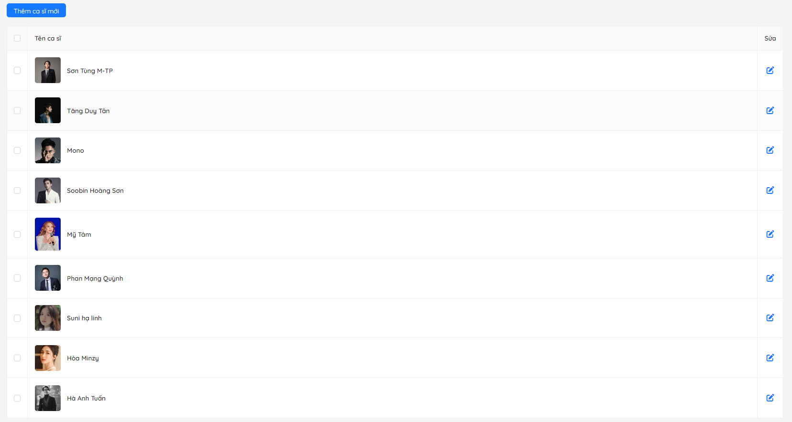
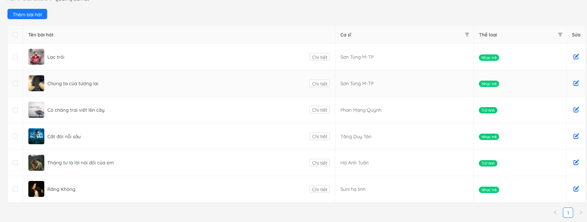
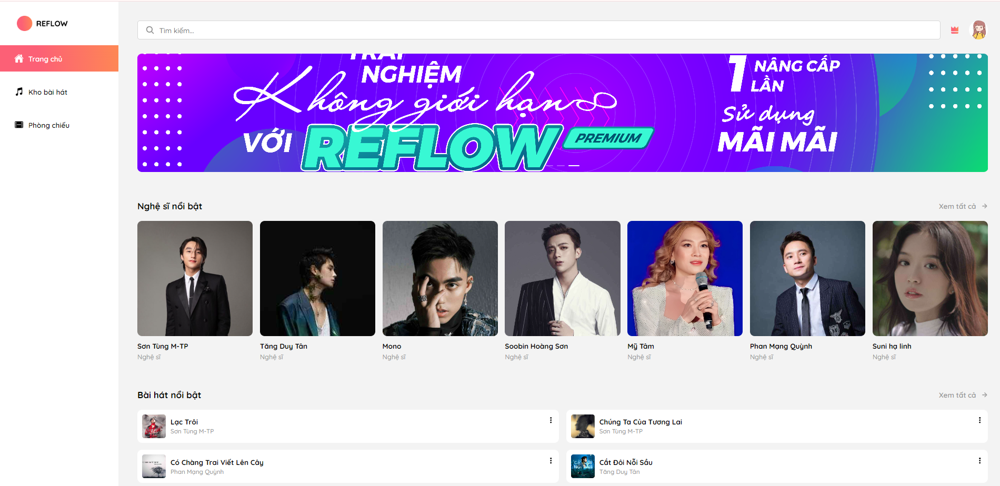
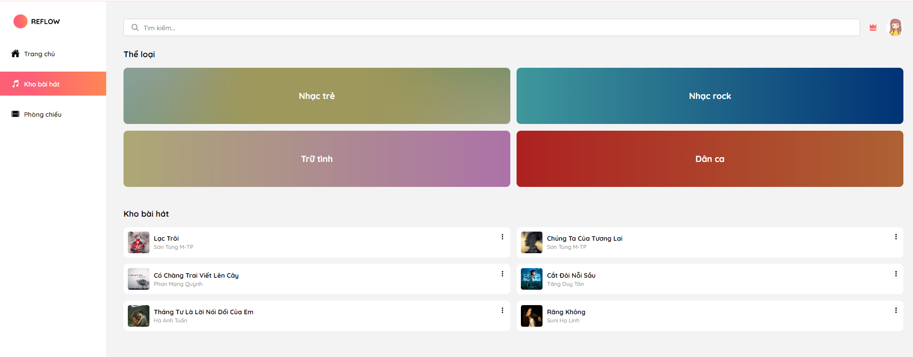
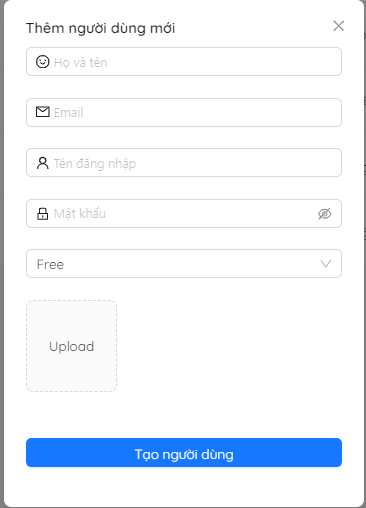
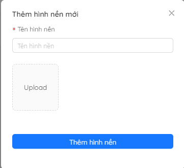
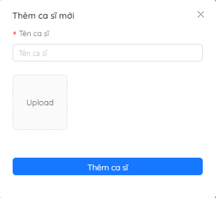
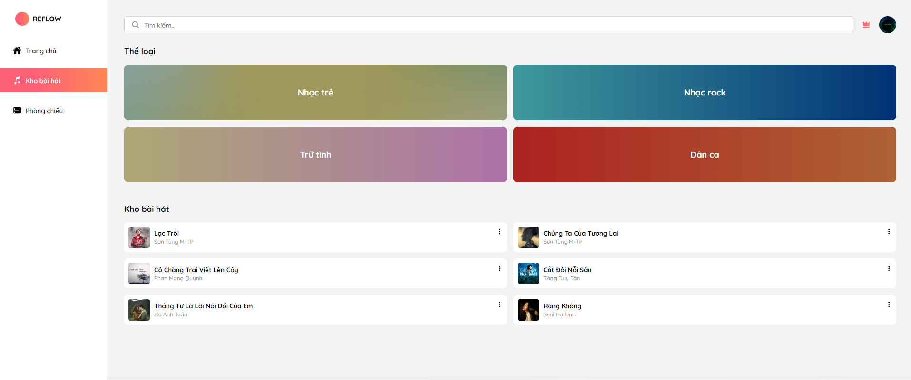

# reflow_nodejs

Mô tả ngắn gọn về dự án.
Khách hàng cần xây dựng trang web trình chiếu lời bài hát Reflow với các chức năng: đăng nhập, đăng ký, xem danh sách các bài hát, trình chiếu lời bài hát, thay đổi thứ tự các đoạn trong bài hát, lưu danh sách những bài hát yêu thích,…

## Tính Năng

- Liệt kê các tính năng quan trọng của dự án.
- Ví dụ: Đăng nhập, đăng ký tài khoản, tìm kiếm sản phẩm, xem danh mục, đặt hàng, ...

## Cài Đặt

1. Di chuyển vào thư mục dự án:
  -cd ten-du-an
2. Cài đặt các gói phụ thuộc:
  -npm install
3.Chạy ứng dụng trong chế độ phát triển:
  -npm start
## Công Nghệ Sử Dụng

- React.js cho phía người dùng.
- Node.js cho phía máy chủ.
- MongoDB để lưu trữ dữ liệu.

## Thành Viên Nhóm

- Võ Quốc Thắng (Trưởng Nhóm)
- Trương Thành Luân
- Lâm Minh Trung

## Ảnh Minh Họa

Dưới đây là một số ảnh minh họa của dự án:

- 
- 
- 
- 
- 
- 
- 
- 
- 
- 

